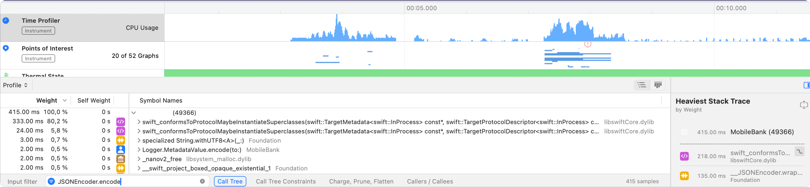

# Foundation.JSONDecoder/Encoder benchmarks

## Table of Contents

1. [Purpose](#purpose)
2. [JSONDecoder/Encoder Performance Problem](#jsondecoderencoder-performance-problem)
3. [JSONDecoder Performance Flaws](#jsondecoder-performance-flaws)
4. [Proposed Optimizations](#proposed-optimizations)
5. [Optimizations Results](#optimizations-results)
6. [Apple Benchmark Overview](#apple-benchmark)
7. [Apple Benchmark Flaws](#apple-benchmark-flaws)
8. [This Benchmark](#this-benchmark)

## Purpose

I want to demonstrate how massively Swift Runtime can harm JSONDecoder/Encoder performance in big projects.

Firstly, we will dive into Swift Runtime protocol casting method.

Secondly, JSONEncoder/Decoder performance flaws will be analyzed.

Thirdly, Performance Optimizations will be proposed.

At last, we will cover Apple Benchmark flaws and compare it to this benchmark.

## JSONDecoder/Encoder Performance Problem

### Introduction

`swift_conformsToProtocolMaybeInstantiateSuperclasses` method is slow, because it traverses all protocol-conformance-descriptors in whole app when gets called first time for pair (class/enum/struct, protocol).

EmergeTools have great [article](https://www.emergetools.com/blog/posts/SwiftProtocolConformance) about poor performance of `swift_conformsToProtocolMaybeInstantiateSuperclasses`.

Briefly, the more protocol-conformance your app has, the slower is `swift_conformsToProtocolMaybeInstantiateSuperclasses`. Our app has more than 150k of protocol conformances. It can be easily measured using this bash one-liner.

`otool -l path/to/your/binary | grep '__swift5_proto$' -A 5 | grep 'size' | awk '/size/ { hex = $2; sub("0x", "", hex); print int("0x" hex)/4 + 0 }'`

We take size of `__swift5_proto` section and divide it by 4 (4-byte integer offsets are stored here).

#### When `swift_conformsToProtocol` is called

In short, there are 3 ways to trigger this method:

- `T.self is SomeProtocol.Type`
- `as?/as!/as (in switch statement) SomeProtocol`
- Generic-classes with type-generic-constraints
  - `swift_conformsToProtocol` is triggered because class metadata contains GenericParameterVector. And GenericParameterVector has to contain protocol-witness-tables for each protocol that generic parameter conforms.

### JSONDecoder Performance Flaws

#### unwrap function

The first place in `JSONDecoder` where `swift_conformsToProtocolMaybeInstantiateSuperclasses` is used is `unwrap` function

```swift
func unwrap<T: Decodable>(_ mapValue: JSONMap.Value, as type: T.Type, for codingPathNode: _CodingPathNode, _ additionalKey: (some CodingKey)? = nil) throws -> T {
    ...
    if T.self is _JSONStringDictionaryDecodableMarker.Type {
        return try self.unwrapDictionary(from: mapValue, as: type, for: codingPathNode, additionalKey)
    }
    ...
}
```

#### KeyedDecodingContainer

[`KeyedDecodingContainer`](https://developer.apple.com/documentation/swift/keyeddecodingcontainer) has type-generic-constraint: `K: CodingKey`. It is the second place where `swift_conformsToProtocol` gets called.

#### JSONDecoder swift_conformsToProtocol Performance Impact


`swift_conformsToProtocol` consumes at least 84% of all `JSONDecoder.decode` time in our app startup scenario.

### JSONEncoder Performance Flaws

#### wrapGeneric function

The first place in `JSONEncoder` where `swift_conformsToProtocolMaybeInstantiateSuperclasses` is used is `wrapGeneric` function

```swift
func wrapGeneric<T: Encodable>(_ value: T, for additionalKey: (some CodingKey)? = _CodingKey?.none) throws -> JSONEncoderValue? {
    ...
    else if let encodable = value as? _JSONStringDictionaryEncodableMarker {
        return try self.wrap(encodable as! [String:Encodable], for: additionalKey)
    } else if let array = value as? _JSONDirectArrayEncodable {
        ...
    }
    ...
}
```

#### KeyedEncodingContainer

[`KeyedEncodingContainer`](https://developer.apple.com/documentation/swift/keyedencodingcontainer) has type-generic-constraint: `K: CodingKey`. It is the second place where `swift_conformsToProtocol` gets called.

#### JSONEncoder swift_conformsToProtocol Performance Impact

.

`swift_conformsToProtocol` consumes at least 84% of all `JSONEncoder.encode` time in out app startup scenario.

## Proposed Optimizations

Firstly ABI/API break-free optimizations will be covered:

### \#1 JSONDecoder unwrap optimization

`_JSONStringDictionaryDecodableMarker` is used to make `String`-keyed Dictionaries exempt from key conversion. So if there is no key-conversion we can skip this slow check:

```swift
switch options.keyDecodingStrategy {
  case .useDefaultKeys:    
    break
  case .convertFromSnakeCase, .custom:    
    if T.self is _JSONStringDictionaryDecodableMarker.Type {        
       return try unwrapDictionary(...)    
    }
}

return try self.with(value: mapValue, path: codingPathNode.appending(additionalKey)) {
    try type.init(from: self)
}
```

instead of

```swift
if T.self is _JSONStringDictionaryDecodableMarker.Type {
    return try self.unwrapDictionary(from: mapValue, as: type, for: codingPathNode, additionalKey)
}

return try self.with(value: mapValue, path: codingPathNode.appending(additionalKey)) {
    try type.init(from: self)
}
```

So this optimization is suitable only for `.useDefaultKeys` strategy.

### \#2 JSONEncoder wrapGeneric optimization

There are two ways to attempt optimization of this function.

- If we believe that `as? _JSONDirectArrayEncodable` deals more benefit than harm to performance (at least in our app and in this benchmark it does more harm), then we will optimize only `_JSONStringDictionaryEncodableMarker` check the same way we did it for `JSONDecoder` and `_JSONStringDictionaryDecodableMarker`
- If not it's better to remove `as? _JSONDirectArrayEncodable` check at all

Here is `_JSONStringDictionaryEncodableMarker` check optimization:

```swift
switch options.keyEncodingStrategy {
  case .useDefaultKeys:    
    break
  case .convertToSnakeCase, .custom:    
    if let encodable = value as? _JSONStringDictionaryEncodableMarker {        
      return try wrap(encodable as! [String: Encodable], for: additionalKey) 
    }
}
```

So this optimization is suitable only for `.useDefaultKeys` strategy.

Optimization \#1 and \#2 are implemented in `FastCoders` library.

### \#3 Possibly ABI/API breaking optimizations

So here we will try to solve performance issue with `KeyedDecodingContainer` and `KeyedEncodingContainer` type-generic-constraints.

The problem is not about calling `KeyedDecodingContainer` or `KeyedEncodingContainer` init, it is about referencing type with specified generic-type:

For example, take this code:

```swift
import Foundation

struct A: Codable {
    let a: Int
}
```

Its `init(from: Decoder) throws` method SIL has line like

```SIL
%5 = alloc_stack [lexical] [var_decl] $KeyedDecodingContainer<A.CodingKeys>, scope 22 
```

And its IR is:

```IR
  %4 = call ptr @__swift_instantiateConcreteTypeFromMangledName(ptr @"demangling cache variable for type metadata for Swift.KeyedDecodingContainer<output.A.(CodingKeys in _60494E8B9C642A7C4A26F3A3B6CECEB9)>") #2, !dbg !194
```

Internally `__swift_instantiateConcreteTypeFromMangledName` triggers `swift_conformsToProtocol` in this scenario.

So we mention type `KeyedDecodingContainer` with specific type `A.CodingKeys`.

`func encode(to: Encoder) throws` has the same flaw.

There are two possible ways to tackle them:

- Change `KeyedDecodingContainer` and `KeyedEncodingContainer` type signature to avoid type generic constraints (wasn't implemented in this repository)
- Use the same `CodingKey` in `Codable/Decodable/Encodable` conformance auto-generated code. For example, `String`.

#### \#3.1 Changing type signature

So the trick is to get rid of `K: CodingKey` type-generic-constraint in type-declaration and move it to `extension`. So there will be no need for GenericParameterVector to contain protocol-witness-table and there will be no `swift_conformsToProtocol` call when generic-type is mentioned or instantiated.

Before:

```swift
public struct KeyedDecodingContainer<K: CodingKey> :
  KeyedDecodingContainerProtocol
{
  public typealias Key = K

  /// The container for the concrete decoder.
  internal var _box: _KeyedDecodingContainerBase

  /// Creates a new instance with the given container.
  ///
  /// - parameter container: The container to hold.
  public init<Container: KeyedDecodingContainerProtocol>(
    _ container: Container
  ) where Container.Key == Key {
    _box = _KeyedDecodingContainerBox(container)
  }

  /// The path of coding keys taken to get to this point in decoding.
  public var codingPath: [any CodingKey] {
    return _box.codingPath
  }

  // continue to conform to KeyedDecodingContainerProtocol protocol
  ...
}
```

After:

```swift
public struct KeyedDecodingContainer<K>
{
  /// The container for the concrete decoder.
  internal var _box: _KeyedDecodingContainerBase

  /// Creates a new instance with the given container.
  ///
  /// - parameter container: The container to hold.
  public init<Container: KeyedDecodingContainerProtocol>(
    _ container: Container
  ) where Container.Key == Key {
    _box = _KeyedDecodingContainerBox(container)
  }
}

extension KeyedDecodingContainer: KeyedDecodingContainerProtocol where K: CodingKey {
  public typealias Key = K

  /// The path of coding keys taken to get to this point in decoding.
  public var codingPath: [any CodingKey] {
    return _box.codingPath
  }

  // continue to conform to KeyedDecodingContainerProtocol protocol
  ...
}
```

Same trick can be applied to `KeyedEncodingContainer`.

Note: despite `_KeyedDecodingContainerBox` has type-generic-constraint it seems like we can avoid rewriting code to avoid it because of the way it gets called:

```swift
public init<Container: KeyedDecodingContainerProtocol>(
    _ container: Container
) where Container.Key == Key {
    _box = _KeyedDecodingContainerBox(container)
}
```

In this scenario, in IR-code there is reference to protocol-witness-table of `Container` implementing `KeyedDecodingContainerProtocol`:

```ir
define protected swiftcc ptr @"output.KeyedDecodingContainerV2.init<A where A == A1.Key, A1: Swift.KeyedDecodingContainerProtocol>(A1) -> output.KeyedDecodingContainerV2<A>"(ptr noalias %0, ptr %K, ptr %Container, ptr %Container.KeyedDecodingContainerProtocol) #0 !dbg !84
```

and there is no `__swift_instantiateConcreteTypeFromMangledName` call.

#### \#3.2 Use String as CodingKey

Why this would be faster:

- `swift_conformsToProtocol` works slowly only when it gets called for the first time for each (class/enum/struct, protocol) pair.
- So if we will use `String` as `CodingKey`, `swift_conformsToProtocol` will be called with the same types: `String` and `CodingKey`
- And only first call will be slow. All subsequent calls are going to be much-much faster, because `ConcurrentReadableHashMap` is used for caching in `swift_conformsToProtocol`.

##### How String can conform CodingKey

```swift
extension String: CodingKey {    
  public init?(stringValue: String) { 
    self = stringValue 
  }    
  public init?(intValue: Int) { nil }    
  public var intValue: Int? { nil }    
  public var stringValue: String { 
    self 
  }
}
```

##### How this can be implemented

We can introduce experimental flag. When flag is enabled, we don't auto-generate `enum CodingKeys` for our `struct/enum` and use raw `String` as `CodingKeys` in `init(from: Decoder) throws` and `encode(to: Encoder) throws`.

##### Additional advantages

Each auto-generated `enum CodingKeys` adds 5 protocol-conformance-descriptors. [godbolt](https://godbolt.org/z/z3rE1b5xs):

- `CodingKey`
- `Hashable`
- `Equatable`
- `CustomDebugStringConvertible`
- `CustomStringConvertible`

Also, it each `CodingKey` adds around 1.8 kb to app size (measured on the same 10k `Codable` structures):

- codable-benchmark-package-no-coding-keys - where `String` is used as `CodingKey` but there are `CodingKeys` to match `__swift5_proto` section size
  - 49 mb
- codable-benchmark-package-no-coding-keys-measure-size  - where `String` is used as `CodingKey` and there are no `CodingKeys`
  - 31.1 mb
- So each `CodingKey` adds around 1.8 kb to application binary size.

So if shared `CodingKey` is implemented we could:

- Optimize application size
- Optimize overall application performance due to boosting `swift_conformsToProtocol` method by `__swift5_proto` section size reduction.
  - codable-benchmark-package-no-coding-keys has 70321 protocol conformance descriptos
  - codable-benchmark-package-no-coding-keys-measure-size has only 20321 protocol conformance descriptos

### Optimizations results

#### Measurements in our app

In our app we applied only `JSONDecoder.unwrap` and `JSONEncoder.wrapGeneric` optimizations without using `String` as `CodingKeys`.

We've measured all `JSONDecoder.decode` and `JSONEncoder.encode` durations and added them together.

We have 80k measurements from different devices. ~40k with optimized `JSONDecoder` and `JSONEncoder` and ~40k with standard `JSONDecoder` and `JSONEncoder` with duration logging.

|        quantile               | 0.1 | 0.25 | 0.5 | 0.75 | 0.9 |
|-----------------------|--------------|---------------|--------------|---------------|--------------|
| standard JSONDecoder  | 198 ms          | 282 ms           | 422 ms         | 667 ms          | 1017 ms        |
| optimized JSONDecoder | 100 ms          | 133 ms          | 200 ms         | 322 ms          | 528 ms         |
| Difference            | ↑49.5%       | ↑52.8%        | ↑52.6%       | ↑51.7%        | ↑48.1%       |

And for `JSONEncoder`:

|          quantile             | 0.1  | 0.25  | 0.5  | 0.75  | 0.9  |
|-----------------------|--------------|---------------|--------------|---------------|--------------|
| standard JSONEncoder  | 59 ms        | 94 ms         | 159 ms       | 289 ms        | 547 ms       |
| optimized JSONEncoder | 14 ms        | 30 ms         | 73 ms        | 135 ms        | 220 ms       |
| Difference            | ↑76%         | ↑68%          | ↑54%         | ↑53.2%        | ↑59.8%       |

Briefly, new `JSONDecoder` became as twice as fast as standard `JSONDecoder` and `JSONEncoder` is at least twice as fast as standard `JSONEncoder`.

#### This benchmark measurements

##### JSONDecoder

In this benchmark I've measured performance in 4 variations:

- standard `JSONDecoder`
- standard `JSONDecoder` + `String` as `CodingKey`
- optimized `JSONDecoder`
- optimized `JSONDecoder` + `String` as `CodingKey`

|          quantile                               | 0.25  | 0.5   | 0.75   |
|---------------------------------------------|----------------|----------------|-----------------|
| standard JSONDecoder                        | 5.81 s         | 5.826 s        | 5.86 s          |
| standard JSONDecoder + String as CodingKey  | 3.24 s (↑44%)  | 3.26 s (↑44%)  | 3.29 s (↑43.9%) |
| optimized JSONDecoder                       | 2.64 s (↑55%)  | 2.65 s (↑55%)  | 2.66 s (↑54.6%) |
| optimized JSONDecoder + String as CodingKey | 0.113 s (↑98%) | 0.114 s (↑98%) | 0.116 s (↑98%)  |

##### JSONEncoder

In this benchmark I've measured performance in 4 variations:

- standard `JSONEncoder`
- standard `JSONEncoder` + `String` as `CodingKey`
- optimized `JSONEncoder`
- optimized `JSONEncoder` + `String` as `CodingKey`

|             quantile                                | 0.25    | 0.5     | 0.75    |
|---------------------------------------------|------------------|------------------|------------------|
| standard JSONEncoder                        | 8.06 s           | 8.08 s           | 8.12 s           |
| standard JSONEncoder + String as CodingKey  | 5.49 s (↑32%)    | 5.52 s (↑32%)    | 5.55 s (↑32%)    |
| optimized JSONEncoder                       | 2.67 s (↑67%)    | 2.68 s (↑67%)    | 2.69 s (↑67%)    |
| optimized JSONEncoder + String as CodingKey | 0.148 s (↑98.1%) | 0.149 s (↑98.2%) | 0.151 s (↑98.1%) |

My benchmark illustrates how big Swift Runtime slows down `JSONDecoder` and `JSONEncoder`.

## Apple Benchmark

Swift-foundation repository has some JSONDecoder/Encoder benchmarking logic: [JSONBenchmark.swift](https://github.com/swiftlang/swift-foundation/blob/4e013668a999a01b9cca29473a2c687e707f23cd/Benchmarks/Benchmarks/JSON/JSONBenchmark.swift#L81).

### Apple Benchmark Flaws

- It decodes/encode the same models for 1 bln times without relaunching app
  - This way all `swift_conformsToProtocol` overhead is disguised, because `swift_conformsToProtocol` is slow only on first iteration.
  - Small binary size and small `__swift5_proto` section

## This benchmark

### Structure

- Library `FastCoders` contains optimized realizations of `JSONDecoder`/`JSONEncoder`
- `RegularModels` contains 10k Codable models with standard Codable implementation. These 10k Codable models can be semantically splitted to 2.5k groups of 4.
- `StringCodingKeyModels` contains same 10k Codable models with manually implemented `Codable` with `String` as `CodingKey`
- `codable-benchmark-package` - target where 2.5k decodings and encodings of `RegularModels` duration is measured
- `codable-benchmark-package-no-coding-keys` - target where 2.5k decodings and encodings of `StringCodingKeyModels` duration is measured.
- `codable-benchmark-package` and `codable-benchmark-package-no-coding-keys` use `A1_Hierarchy.json` file for decoding. Its size is only 319 bytes.

Notes:

- To match size of `__swift5_proto` in `codable-benchmark-package-no-coding-keys` match size of `__swift5_proto` in `codable-benchmark-package` I've generated CodingKeys enum in each class but it is not used in `encode(to: Encoder)` or `decode(from: Decoder)`.

### Building

Use `./build.sh` for building and stripping `codable-benchmark-package` and `codable-benchmark-package-no-coding-key`.

### Checking __swift5_proto size

To get amount of protocol-conformance-descriptors in binary use this script:

- `otool -l .build/arm64-apple-macosx/release/codable-benchmark-package | grep '__swift5_proto$' -A 5 | grep 'size' | awk '/size/ { hex = $2; sub("0x", "", hex); print int("0x" hex)/4 + 0 }'` outputs 70320.
- `otool -l .build/arm64-apple-macosx/release/codable-benchmark-package-no-coding-keys | grep '__swift5_proto$' -A 5 | grep 'size' | awk '/size/ { hex = $2; sub("0x", "", hex); print int("0x" hex)/4 + 0 }'` outputs 70321.
- So in case of `swift_conformsToProtocol` performance both binaries are pretty similar.

### Running

- `codable-benchmark-package` and `codable-benchmark-package-no-coding-key` has 4 modes:
  - `decode` - measures decoding using standard `JSONDecoder`
  - `decode_new` - measure decoding using optimized `JSONDecoder`
  - `encode` - measure encoding using standard `JSONEncoder`
  - `encode_new` - measure encoding using standard `JSONEncoder`

I've used `run_bench.py` script to run binary for each mode. It measures each binary and each mode 100 times. It takes a while to run. You can easiliy adjust amount of repetitions in `run_bench.py`.
